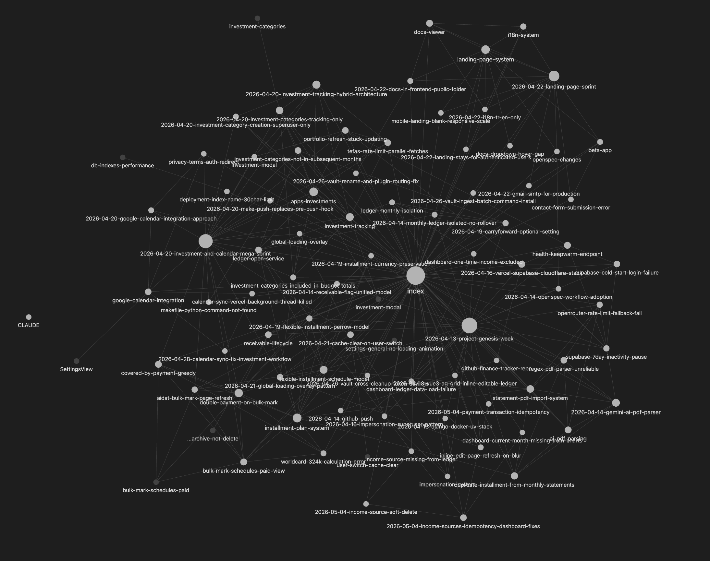

# Claude Obsidian Vault Skill

[English](README.md) | **Türkçe**

> Claude Code'a kalıcı bir hafıza kazandırır. Her oturum, aranabilir bir markdown wiki'ye arşivlenir — geçmiş kararlar, hatalar ve örüntüler her zaman bağlamda olur, bir daha açıklanmak zorunda kalınmaz.

---

## Neden kullanmalısın?

Vault olmadan, her Claude Code oturumu sıfırdan başlar. Aynı mimari kararları tekrar tekrar açıklarsın, Claude daha önce çözdüğün hataları yeniden keşfeder ve üç ay önce öğrenilen örüntüler hiç var olmamış gibi kaybolur.

Vault ile:

- **Geçmiş kararlar, ilk mesajından önce bağlamda olur** — Claude onları oturum başında otomatik okur
- **Hatalar düzelmiş kalır** — kök nedenler ve çözümler kayıt altında tutulur
- **Bilgi birikir** — her oturum bir sonrakini daha verimli kılar

---

## Kurulum

İki yöntemden birini seç. Her ikisi de aynı skill, komutlar ve hook'u yükler.

### Seçenek A — Claude Code plugin (önerilen)

Claude Code içinde şu iki komutu yaz:

```
/plugin marketplace add mehmetcakoglu/claude-obsidian-vault-skill
/plugin install vault@claude-obsidian-vault-skill
```

Ardından **Claude Code oturumunu yeniden başlat**.

### Seçenek B — Bağımsız kurulum (macOS / Linux)

```bash
git clone https://github.com/mehmetcakoglu/claude-obsidian-vault-skill.git
cd claude-obsidian-vault-skill
./install.sh
```

### Seçenek C — Bağımsız kurulum (Windows PowerShell)

```powershell
git clone https://github.com/mehmetcakoglu/claude-obsidian-vault-skill.git
cd claude-obsidian-vault-skill
.\install.ps1
```

> **Python 3** tüm platformlarda PATH'te olması gerekir.

**Özel vault konumu** — kurulumdan önce `CLAUDE_VAULT` ortam değişkenini ayarla:

```bash
CLAUDE_VAULT=/istediğin/yol ./install.sh          # macOS / Linux
$env:CLAUDE_VAULT = "D:\vault"; .\install.ps1     # Windows
```

Bağımsız kurulumdan sonra `SessionStart` hook'unun aktif olması için **Claude Code oturumunu yeniden başlat**.

---

## İlk kurulum (5 dakika)

**1. Kurulumu doğrula**

Yeni bir Claude Code oturumunda çalıştır:
```
/vault:status
```
Vault yolunu, plugin versiyonunu ve yapılandırmayı görmelisin — hepsi yeşil. Bir sorun varsa ne yapman gerektiğini söyler.

**2. Proje vault'u oluştur** _(isteğe bağlı ama önerilir)_

Bir projenin içinde şunu çalıştır:
```
/vault:init
```
Claude 5 kısa soru sorar (proje adı, teknoloji yığını, alan terimleri) ve özelleştirilmiş bir bilgi şemasıyla `docs/vault/` dizinini oluşturur. Her proje için bir kez yapılır.

**3. İlk oturumu arşivle**

```
/vault:scan          # kuyrukta ne var, bak
/vault:ingest        # en üstteki oturumu arşivle
```

Bu kadar. Bundan sonra `SessionStart` hook'u, Claude Code her açıldığında taramayı otomatik yapar. Arşivlemeye hazır olduğunda `/vault:ingest` çalıştırman yeterli.

---

## Komutlar

| Komut | Ne yapar |
|---|---|
| `/vault:help` | Tüm komutları listeleyen hızlı başvuru kartı |
| `/vault:status` | Sistem durumu — vault yolu, versiyon, kuyruk boyutu, yapılandırma |
| `/vault:init` | Aktif proje için `docs/vault/` dizinini oluşturur |
| `/vault:scan` | Bekleyen ingest kuyruğunu yeniler ve gösterir |
| `/vault:ingest [id]` | Sıradaki (veya belirli bir) oturumu arşivler |
| `/vault:batch-ingest [N\|all]` | Tek seferde en fazla N oturum arşivler (varsayılan: 5) |
| `/vault:skip <id>` | Bir oturumu kuyruktan kalıcı olarak çıkarır |
| `/vault:auto-ingest [on\|off\|status]` | Oturum başında otomatik arşivlemeyi açar/kapatır |
| `/vault:auto-ingest [on\|off] [max N]` | Aynı zamanda oturum başına maksimumu ayarlar |
| `/vault:update` | GitHub'dan en son sürümü çekip yeniden kurar |

---

## Günlük kullanım

### Oturumları arşivleme

Oturumlar bittikten yaklaşık 10 dakika sonra kuyrukta belirir. İstediğin zaman işleyebilirsin:

```
/vault:scan              # kuyruğu kontrol et
/vault:ingest            # bir oturumu arşivle (en büyük önce)
/vault:batch-ingest 3    # tek seferde en fazla 3 oturum
/vault:skip a1b2c3d4     # arşivlemek istemediğin oturumu atla
```

Arşivlenen her oturum otomatik olarak yönlendirilir:
- Proje `docs/vault/CLAUDE.md` içeriyorsa → **proje vault'u**
- İçermiyorsa → `~/Global Claude Vault/` konumundaki **global vault**

### Soru sorma

Doğal bir dille sorabilirsin. `vault` skill'i şu tür ifadeleri tanır:
- _"X konusunda ne karar vermiştik?"_
- _"Bu hatayı daha önce gördük mü?"_
- _"Y'yi neden seçmiştik?"_

Claude doğru `index.md`'yi okur, bağlantıları takip eder ve kaynak göstererek cevap verir.

### Vault temizliği

```
check the vault
```

Claude yalnız kalmış sayfaları, güncelliğini yitirmiş iddiaları, geçersiz kod referanslarını ve yinelenen varlıkları tarar; ardından `syntheses/lint-YYYY-MM-DD.md` dosyasına bir rapor yazar.

---

## Yapılandırma

Ayarlar `~/Global Claude Vault/vault-config.json` dosyasında tutulur. En kolay yol slash komutları:

```
/vault:auto-ingest status       # mevcut duruma bak
/vault:auto-ingest on           # otomatik arşivlemeyi aç
/vault:auto-ingest on max 3     # aç, oturum başına en fazla 3 işle
/vault:auto-ingest off          # kapat (manuel mod, varsayılan)
```

**Ne zaman açmalısın:** Claude'un neyi arşivleyeceğine kendi karar vermesine güveniyorsun ve sıfır bakım istiyorsun.

**Ne zaman kapalı bırakmalısın (varsayılan):** Her oturumu yazılmadan önce gözden geçirmek istiyorsun ya da arşivleme çalışma akışını bozacak.

---

## Nasıl çalışır

```
~/.claude/projects/*/*.jsonl        (Claude Code oturum transkriptleri)
          │
          │  vault-context.py her oturum başında çalışır (senkron)
          │    ├─ bekleyen kuyruğu tarar
          │    ├─ yoksa proje varlığını otomatik oluşturur
          │    └─ vault indeksi + son oturumlar → Claude bağlamına eklenir
          ▼
   ~/Global Claude Vault/state/pending.md
          │
          │  /vault:ingest (kullanıcı tetikler veya auto_ingest=true ile otomatik)
          ▼
    ┌─────┴──────────────────────────────────┐
    │                                        │
    ▼                                        ▼
Global vault                         Proje vault'u
~/Global Claude Vault/               <repo>/docs/vault/
 · projeler arası kararlar            · alana özgü kurallar
 · Claude Code örüntüleri             · mimari kararlar
 · öğrenilen dersler                  · hata/çözüm geçmişi
                                      · varlıklar & kavramlar
    │                                        │
    └──────────── ortak ingested.txt ────────┘
           (bir oturum hiçbir zaman iki kez arşivlenmez)
```

Tarama ve bağlam enjeksiyonu otomatik gerçekleşir. Arşivleme (sayfa yazmak) varsayılan olarak kullanıcı tarafından tetiklenir — sırları filtreler, yönlendirme kararı verir ve kalıcı dosyalar yazar, bu nedenle insan gözetimini hak eder.

Obsidian'da açıldığında vault, gezilebilir bir bilgi grafiğine dönüşür:



_Her düğüm bir sayfadır (oturum, karar, varlık, kavram, hata). Büyük düğümler daha fazla gelen bağlantıya sahiptir — bunlar arşivinizdeki en çok referans verilen bilgi parçalarıdır._

---

## Token tasarrufu

`/vault:status` vault'un şimdiye kadar kaç token tasarrufu sağladığını gösterir. Bu sayının nasıl hesaplandığını ve neden anlamlı olduğunu anlamak için:

### Claude Code oturumları aslında nasıl çalışır

Her mesaj gönderiminde Claude Code, **o ana kadarki tüm konuşma geçmişini** API'ye yeniden gönderir. 10 prompt içeren bir oturumda bağlam kümülatif olarak büyür:

```
1. tur:   30K token gönderildi
2. tur:   60K token gönderildi   ← tüm geçmiş yeniden gönderildi
3. tur:   90K token gönderildi
...
10. tur: 300K token gönderildi
──────────────────────────────
Toplam:  ~1,65M token API'ye gönderildi (oturum boyunca)
```

Diskteki JSONL dosyası ise her mesajı **bir kez** kaydeder — 3 MB'lık bir dosya ~600K token benzersiz içerik barındırır; API'ye gönderilen 1,65M token'ı değil.

### "Tasarruf" burada ne anlama gelir

Vault, *mevcut* bir oturum sırasında harcanan token'ları azaltmaz. Ortadan kaldırdığı şey, her *yeni* oturumun başındaki **soğuk başlangıç maliyetidir** — dosyaları yeniden okumak ve geçmiş kararları yeniden açıklamak için harcanacak token'lar:

```
Vault yok — yeni oturum:
  Bağlamı yeniden oluşturmak için dosya oku    ~50–600K token
  Kullanıcı geçmiş kararları yeniden açıklar   ~300 token
  Claude bilinen örüntüleri yeniden keşfeder   (bazen hatalı)

Vault var — yeni oturum:
  Önceden hazırlanmış özet inject edilir        ~800–2.000 token
```

### Tasarruf nasıl ölçülür

JSONL dosya boyutu, "bu oturumda ne kadar bilgi vardı" sorusunun gerçek cevabıdır. Vault olmadan gelecekte o oturumun içeriğini anlamak için transkriptin tamamını ya da bir kısmını okumak gerekir. Vault bunu oturum başında inject edilen küçük bir özete sıkıştırır.

```
oturum başına tasarruf ≈ (JSONL bayt ÷ 5) − inject edilen token
```

_1 token ≈ 5 bayt — JSON transcript verisi için (JSON yapısal yükü düz metinden daha ağır)._

3 MB'lık bir oturum ~600K token bilgi içerir. Vault bunun özünü ~1.200 token olarak inject eder. Sıkıştırma oranı genellikle **200–500×** arasındadır.

---

## Platform desteği

| Platform | Durum |
|---|---|
| macOS | Tam destek |
| Linux | Tam destek |
| Windows (Git Bash / WSL) | `install.sh` ile tam destek |
| Windows (PowerShell) | `install.ps1` ile tam destek |
| Claude.ai web / Claude Work | Desteklenmiyor (yerel dosya sistemi yok) |

---

## Katkılar

**LLM-Wiki örüntüsü** (`RAW → WIKI ← SCHEMA`) ve INGEST/QUERY/LINT terminolojisi:
[Selma Kocabıyık](https://github.com/selmakcby) —
[knowledge-pipeline](https://github.com/selmakcby/knowledge-pipeline).

Claude Code paketlemesi (slash komutlar, otomatik tarama, hibrit kapsam, oturum kaydı):
[Mehmet Çakoğlu](https://github.com/mehmetcakoglu).

Tüm atıflar için [`docs/ATTRIBUTION.md`](docs/ATTRIBUTION.md) dosyasına bak.

---

MIT Lisansı — [`LICENSE`](LICENSE).
